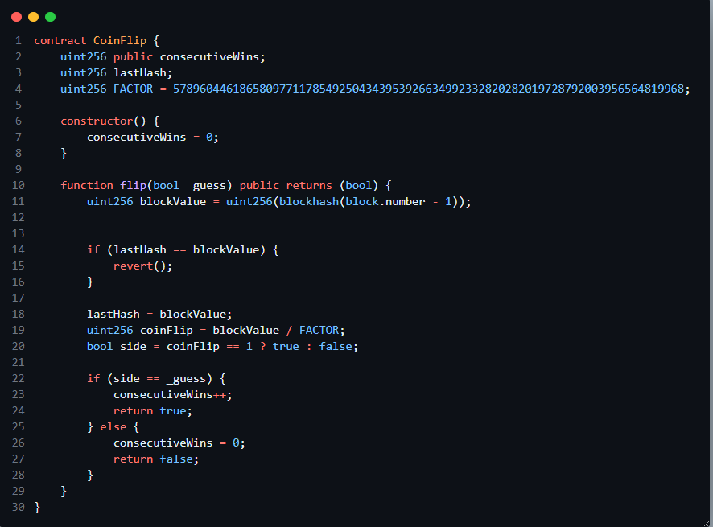
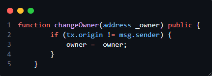

# Ethernaut Challenges - OpenZeppelin

This repository was created to solve the challenges from [Ethernaut](https://ethernaut.openzeppelin.com/), the smart contract hacking game developed by OpenZeppelin.

## Technologies Used

| Technologies Used | Description |
|-------------------|-------------|
| [Foundry](https://book.getfoundry.sh/) | **A fast and efficient framework for Solidity development, testing, and deployment.** |

## How to Run

1. **Install Foundry**:
   ```bash
   curl -L https://foundry.paradigm.xyz | bash
   foundryup
   ```

2. **Install Dependencies**:
   ```bash
   forge install
   ```

## Project Structure

| Directory | Description |
|-----------|-------------|
| `src`     | Contracts and solutions |
| `test`    | Foundry tests to validate the solutions |
| `scripts` | Scripts for deployment and interactions |


[Jump to Found Vulnerabilities](#vulnerabilities)


## Purpose

This repository serves as study material and practice for Smart Contract Security through the Ethernaut challenges.

## Vulnerabilities

This section lists the vulnerabilities found while solving the Ethernaut challenges. Each vulnerability includes a description.

- **Fallback Contract Vulnerability**
 <br>

- **Fallout Contract Vulnerability**: 
  <br>
  
    

    The contract is named Fallout, but the function intended to act as the constructor is named Fal1out (with a digit "1" instead of an "l"). Because of this typo, the function is not recognized as a constructor, and is instead treated as a regular public payable function. Upon deployment, the owner variable remains at its default value: address(0). Since Fal1out is a public function, anyone can call it and set themselves as the owner by sending a transaction. Consequently, ownership is uninitialized and can be claimed by anyone.

    <br>
- **🧩 CoinFlip Contract Vulnerability**: 
<br>
    

    The contract is named Fallout, but the function intended to act as the constructor is named Fal1out (with a digit "1" instead of an "l"). Because of this typo, the function is not recognized as a constructor, and is instead treated as a regular public payable function. Using blockhash as a source of randomness is predictable and can be exploited. The hash of the previous block is public and can be known by anyone. Blockchain data like block hashes are not suitable for generating secure random numbers.
    <br>
 
- **:telephone: Telphone Contract Vulnerability**: 
    <br>
    
    

    When calling changeOwner directly from your EOA, tx.origin equals msg.sender, so the require condition tx.origin != msg.sender fails and the ownership cannot change. However, if an EOA account calls an intermediary malicious contract, the vulnerability can be exploited since tx.origin will not be the same as msg.sender. The tx.origin is the EOA account that started the transaction but the malicious contract might call the function to change the ownership.
 
 


